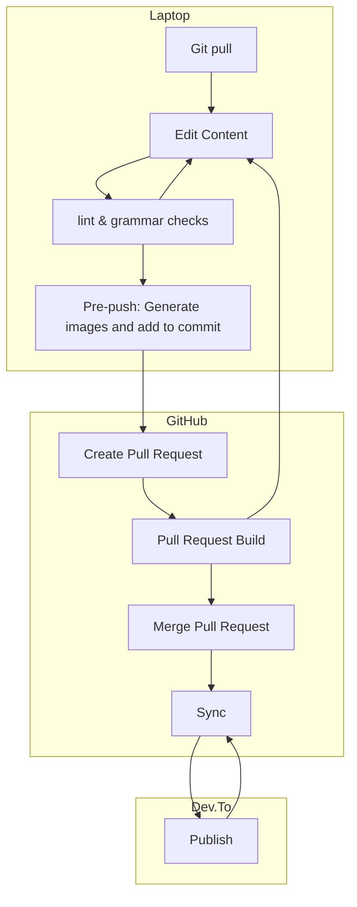

I use [Github](https://www.github.com) to store the code that I write, and [Github Actions](https://github.com/features/actions) to automate my workflows. My [blog](https://dev.to/jonashdown) is hosted on a number of platforms including [Dev.to](https://dev.to/jonashdown), which accepts markdown as an input format and has an [api](https://developers.forem.com/api).

If I could store my blog in Github, I could do the following

- Write blog articles off line and use git to keep them upto date.
- Push completed articles to Github.
- Take advantage of Github Actions to:
  - Publish to various blogging platforms
  - Grammar and spell check
  - Generate and store diagrams using mermaid
  - Inform social media platforms of new/updated articles
  - Display latest articles on my Github profile.

## Generating Diagrams

[Mermaid.js](https://mermaid.js.org/) seemed like the obvious choice as it integrates with Markdown and Github, and importantly has a [commnand line interface](https://github.com/mermaid-js/mermaid-cli), which means it can be used in a script.

Any generated images can use the raw github urls, so a bit of `sed` magic will convert the local urls that mermaid generates into a full url. **N.b** to take advantage of Github as a hosting service, the repo will have to be set as public, otherwise there will be a need to configure tokens and their expiry. I will write about how the repo is secured in another post.

The mermaid cli supports markdown with embedded mermaid diagrams, and can generate images in a number of formats, however platforms like Dev.to do not support SVG as an image format (presumably this is to prevent embedded javascript attacks), so images will need to be generated as pngs.

Whatever `sed` magic I do will need to ultimately need to replace the embedded diagram with a url to a png.

To make the images accessible via a raw github url, I will need to generate and commit them as either a pre-commit or pre-push hook. While this could be a problem storing large binary files for a big repo, it is unlikely to be an issue for a small repo for a blog. If it does become an issue in the future, I will simply host images elsewhere.

## Pre-Publishing

In order to publish quality content, I will need to do the following.
 - Spell and grammar check markdown
 - Lint all artifacts
 - Ensure all code that I write to support my articles works

Again these checks will need to run in either a pre-commit or pre-push hook.

Cspell provides a configurable spell checker and fixer and integrates into VSCode (my IDE of choice). Similarly Biome.js provides a very decent linter. For typechecking I can use tsc. For unit testing any javascript/typescript I will simply use the framework that bun.sh provides. If I decide to blog about other languages, I will use either the built in framework or the most popular.

## Publishing to Dev.to

A quick search of the [Github marketplace](https://github.com/marketplace?category=&type=actions&verification=&query=dev.to) found [Publish to dev.to](https://github.com/marketplace/actions/publish-to-dev-to) maintained and owned by [sinedied](https://dev.to/sinedied) which seems simple enough to use.

This action syncs content between GitHub and Dev.to, keeping the front-matter up to date. Generally this is useful  as the document id will make sure that the correct article is updated when I make edits, however I would like to keep the markdown with embedded mermaid diagrams as the source of truth, and as the content I am writing to Dev.to is generated, I am going have to come up with another way to sync the front-matter.

## Workflow for Editing & Publishing Content
