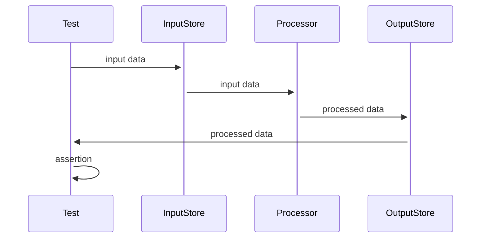

After some recent outages with Github, my team found that a particular repo had a large number of flaky integration tests, which where uncovered when the team did some minor maintenance and highlighted by the outages.

On checking both the main branch and running the builds from developers machines, it became obvious that the flakiness was caused by race condtions within the test suites, as different tests where failing on each build run.

### Some Defintions

Race conditions occur when several processes compete for a resource, and flaky tests are often a manifestation of that.

The team's integration tests are automatically run on an environment like live (in this case an AWS account that has been set up to replicate the live environment) and exercise individual components in a larger microservice architecture. Typically they either write to data stores or trigger events and assert that the expected processing has taken place by interogating other stores or capturing events from the processing.

e.g

## How can race conditions occur ?

### Truncating databases whilst tests are still running

Tidying up test data is good practice as it allows for stacks to be torn down efficiently without leaving any artifacts. However when each test suite attempts to truncate the databases it is using, race conditions are assured as other test suites may not have finished and may find themselves asserting against non-existant data.

### Not allowing processes to complete before assertion

Data processing takes time. By inputting data and immediately asserting against the output will cause race conditions. A slow internet connection will likely pass an integration test, but a fast one will fail.

### Reusing/Copying data between tests

Copying test data between tests is guaranteed to get race conditions. Is test 1's data causing test 2 to pass? Is test 2 failing because test 1 is passing?  Is test 1 passing because test 2 is? No-one really knows, but our `ctl-c/ctrl-v` muscles have had a good workout.

## How can race conditions be prevented?

### Truncate databases after all tests have finished

Have a seperate clean up step to truncate test data, and ensure that all tests are in a finished state.

This also means that failure to delete is not a test failure, and deletion is still possible should a test fail.

### Allow processes to complete before assertion

A simple `sleep` between writing input data and asserting against output data, whilst primitive, might work, however the sleep time will need to be tweaked to ensure processing has finished.

However a better approach exists. Polling the output and asserting over a sensible period of time will allow the processing to take place. Tools like [WaitForExpect](https://www.npmjs.com/package/wait-for-expect) provide a way of polling and will pass a test the moment the assertion is met, and will fail on a timeout.

### Use unique data

Using unique, or better yet random data, will ensure that there is no bleed between tests and keep the assertions clean. Using the builder pattern with random defaults will provide a reusable method of specifying unique data.
